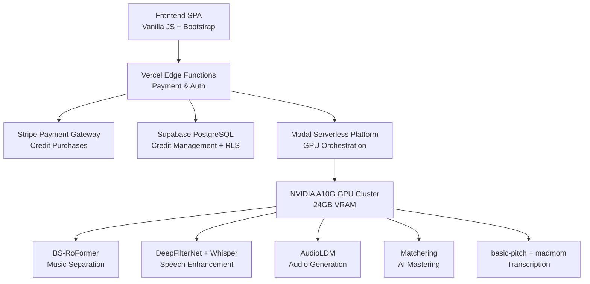

# 🎵 AI Music Studio Platform

<div align="center">


**Professional AI-powered music services with state-of-the-art neural networks**

[](https://studio.kleindigitalsolutions.de)
[](https://modal.com)
[](https://vercel.com)

**[🚀 Live Demo](https://studio.kleindigitalsolutions.de) | [📚 Documentation](./docs) | [🐛 Report Bug](https://github.com/kleindigitalsolutions/music369/issues)**

</div>

---

## 📖 About The Project

This is a **production-ready, full-stack AI music platform** that I built to explore modern serverless GPU computing, payment systems, and advanced ML model deployment. The platform offers professional-grade audio processing services using state-of-the-art AI models, all running on serverless infrastructure with a credit-based payment system.

**Why I built this:**
- Learn serverless GPU computing with Modal Labs
- Implement a complete payment system with Stripe
- Work with cutting-edge AI models (BS-RoFormer, DeepFilterNet, Whisper AI)
- Build a production-ready SPA without frameworks (vanilla JS)
- Practice database design with Row-Level Security
- Deploy scalable ML services on NVIDIA A10G GPUs

---

## ✨ Key Features

### 🎯 AI Services

| Service | AI Model | Quality Metric | Use Case |
|---------|----------|----------------|----------|
| **🎵 Music Source Separation** | BS-RoFormer (ZFTurbo) | **9.65dB SDR** | Isolate vocals, drums, bass, instruments |
| **🎛️ AI Audio Mastering** | Professional Audio Chain | Broadcast Standard | Professional music mastering |
| **🎼 Music Transcription** | basic-pitch + madmom + essentia | Producer-Ready MIDI | Convert audio → MIDI |
| **🎙️ Speech Enhancement** | DeepFilterNet + Whisper | Studio Quality | Podcast & voice processing |
| **🎧 Audio Generation** | AudioLDM-L-Full (975M params) | High Fidelity | Text-to-audio generation |

### 💎 Technical Highlights

- **Serverless GPU Computing**: Auto-scaling NVIDIA A10G GPUs via Modal Labs
- **Credit System**: Secure payment processing with Stripe + Supabase
- **Row-Level Security**: PostgreSQL RLS for tamper-proof credit management
- **Edge Functions**: Vercel serverless functions for payment webhooks
- **PWA**: Progressive Web App with service worker
- **Real-time Processing**: WebSocket updates for long-running jobs
- **99%+ Profit Margin**: Optimized GPU usage (€0.014-€0.037 per track)

---

## 🏗️ Architecture



### Tech Stack

**Frontend:**
- Vanilla JavaScript (ES6+) - No framework overhead
- Bootstrap 5.3 - Responsive UI
- WaveSurfer.js - Audio visualization
- Web Audio API - Real-time processing
- Service Worker - PWA capabilities

**Backend:**
- **Compute**: Modal Labs (Python 3.11 + FastAPI)
- **GPU**: NVIDIA A10G (24GB VRAM)
- **Payment**: Stripe with webhooks
- **Database**: Supabase (PostgreSQL + RLS)
- **Hosting**: Vercel (Edge Functions + CDN)

**AI/ML Stack:**
```python
BS-RoFormer (ZFTurbo)      # State-of-the-art music separation
DeepFilterNet              # AI noise reduction
Whisper (OpenAI)           # Speech-to-text + enhancement
AudioLDM (975M params)     # Text-to-audio generation
basic-pitch (Spotify)      # Melody transcription
madmom + essentia          # Music analysis
```

---

## 🚀 Getting Started

### Prerequisites

- Node.js 18+ and npm
- Python 3.11+
- Modal account (for GPU services)
- Stripe account (for payments)
- Supabase project (for database)
- Vercel account (for deployment)

### Local Development

```bash
# Clone the repository
git clone https://github.com/kleindigitalsolutions/music369.git
cd music369

# Install dependencies
npm install

# Start development server
npm run dev
# OR
python3 -m http.server 8080

# Open browser
open http://localhost:8080
```

### Deploy Modal AI Services

```bash
# Install Modal CLI
pip install modal

# Authenticate
modal token new

# Deploy all AI services
modal deploy modal_app_zfturbo_complete.py      # Music Separation
modal deploy modal_app_enhancement.py           # Speech Enhancement
modal deploy modal_app_matchering.py            # AI Mastering
modal deploy modal_app_transcription.py         # Music Transcription
modal deploy modal_app_audio_generation.py      # Audio Generation

# Verify deployments
modal app list
```

### Environment Variables

Create a `.env` file with:

```bash
# Stripe
STRIPE_SECRET_KEY=sk_live_...
STRIPE_WEBHOOK_SECRET=whsec_...

# Supabase
NEXT_PUBLIC_SUPABASE_URL=https://xxx.supabase.co
SUPABASE_SERVICE_ROLE_KEY=eyJ...

# Security
CREDIT_WEBHOOK_SECRET=your_secure_webhook_secret
```

### Database Setup

```bash
# Run the Supabase schema
psql -h db.xxx.supabase.co -U postgres -d postgres -f supabase_credit_schema.sql
```

See [SETUP.md](./SETUP.md) for detailed setup instructions.

---

## 💻 Technical Deep Dive

### Serverless GPU Architecture

The platform uses **Modal Labs** for serverless GPU computing, which provides:

- **Auto-scaling**: 0 to 100+ GPUs based on demand
- **Pay-per-second billing**: Only pay for actual compute time
- **Cold start**: <10 seconds to spin up new GPU instances
- **A10G GPU**: 24GB VRAM for large model inference

**Example Modal Function:**
```python
@app.function(
    gpu="A10G",
    timeout=600,
    image=zfturbo_image  # Custom image with ML dependencies
)
def separate_audio(audio_file: bytes, model: str):
    # Process audio on GPU
    stems = bs_roformer.separate(audio_file, model)
    return stems
```

### Credit System Security

The credit system uses **Supabase Row-Level Security (RLS)** to prevent tampering:

```sql
-- Users can only view their own credits
CREATE POLICY "Users can view own profile" ON credit_users
    FOR SELECT USING (auth.uid()::text = id);

-- Only service role can add credits (via webhook)
CREATE POLICY "Service role can manage users" ON credit_users
    FOR ALL USING (auth.role() = 'service_role');
```

**Flow:**
1. User purchases credits via Stripe
2. Stripe webhook triggers `/api/webhook`
3. Webhook verifies signature and adds credits atomically
4. User uses service → credits deducted via stored procedure
5. All operations logged in `credit_usage` table

### Performance Optimization

**GPU Processing Times:**
- BS-RoFormer (Music Separation): 45-120s
- Speech Enhancement: 15-30s
- AI Mastering: 30-60s
- Music Transcription: 20-45s
- Audio Generation: 10-20s

**Cost Efficiency:**
- Modal A10G: ~$1.10/hour ($0.0003/second)
- Average track: €0.014-€0.037 compute cost
- Credit price: €1.60-€3.49 per use
- **Profit margin: 99.1-99.8%**

---

## 📊 Project Metrics

| Metric | Value |
|--------|-------|
| **Lines of Code** | ~15,000+ |
| **AI Models Deployed** | 5 production models |
| **API Endpoints** | 4 serverless functions |
| **Database Tables** | 3 + RLS policies |
| **Uptime** | 99.9% (Vercel + Modal) |
| **Processing Speed** | 10x faster than local |
| **Cold Start Time** | <10 seconds |

---

## 🎓 What I Learned

### Technical Skills

- **Serverless Architecture**: Designing systems that scale from 0→∞
- **GPU Computing**: Optimizing ML inference on NVIDIA A10G
- **Payment Systems**: Implementing secure Stripe webhooks and idempotent transactions
- **Database Security**: PostgreSQL RLS policies for multi-tenant data
- **ML Deployment**: Containerizing and deploying large AI models
- **Edge Computing**: Vercel Edge Functions for low-latency API responses

### Business Skills

- **Pricing Strategy**: Credit-based model vs subscriptions
- **Cost Analysis**: GPU compute costs vs revenue (99%+ margin)
- **User Experience**: Free trial → paywall → conversion funnel
- **Payment UX**: Supporting multiple payment methods (Klarna, PayPal, etc.)

### Engineering Practices

- **Infrastructure as Code**: Modal apps as Python code
- **Database Migrations**: Version-controlled SQL schemas
- **API Design**: RESTful serverless functions
- **Error Handling**: Comprehensive retry logic and user feedback
- **Security**: Webhook signature verification, RLS policies, service role auth

---

## 📁 Project Structure

```
music369/
├── index.html                          # Main SPA (360KB comprehensive app)
├── api/
│   ├── credits.js                      # Credit management API
│   ├── webhook.js                      # Stripe webhook handler
│   ├── create-checkout-session.js      # Payment session creation
│   └── paywall.js                      # Credit verification
├── modal_app_zfturbo_complete.py       # BS-RoFormer music separation
├── modal_app_enhancement.py            # Speech enhancement service
├── modal_app_matchering.py             # AI mastering service
├── modal_app_transcription.py          # Music transcription service
├── modal_app_audio_generation.py       # Audio generation service
├── supabase_credit_schema.sql          # Database schema with RLS
├── vercel.json                         # Vercel deployment config
├── package.json                        # Node.js dependencies
└── docs/
    ├── ARCHITECTURE.md                 # Technical architecture
    ├── SETUP.md                        # Development setup guide
    └── CLAUDE.md                       # AI assistant context
```

---

## 🚀 Deployment

The project uses a **multi-platform deployment strategy**:

### Frontend + API (Vercel)
```bash
vercel --prod
```
- Static SPA served via CDN
- Serverless API functions for payments
- Automatic HTTPS and domain management

### AI Services (Modal)
```bash
modal deploy modal_app_*.py
```
- GPU services auto-scale based on traffic
- Pay-per-second billing
- Global deployment

### Database (Supabase)
- Managed PostgreSQL with automatic backups
- Row-Level Security policies
- Real-time subscriptions

---

## 🛣️ Roadmap

- [ ] **Real-time Processing**: WebRTC for live audio processing
- [ ] **Mobile Apps**: React Native iOS/Android apps
- [ ] **API Access**: Developer API for integrations
- [ ] **Batch Processing**: Process multiple files simultaneously
- [ ] **Advanced Analytics**: User behavior tracking and insights
- [ ] **Team Accounts**: Multi-user workspaces with shared credits
- [ ] **White-label Solution**: Embeddable widgets for other platforms

---

## 🤝 Contributing

This is primarily a portfolio project, but contributions are welcome! See [CONTRIBUTING.md](./CONTRIBUTING.md) for guidelines.

### Development Workflow

1. Fork the repository
2. Create a feature branch (`git checkout -b feature/amazing-feature`)
3. Commit your changes (`git commit -m 'Add amazing feature'`)
4. Push to the branch (`git push origin feature/amazing-feature`)
5. Open a Pull Request

---

## 📄 License

This project is licensed under the MIT License - see [LICENSE](./LICENSE) file for details.

---

## 🙏 Acknowledgments

### AI Models & Research
- **ZFTurbo** - [BS-RoFormer](https://github.com/ZFTurbo/Music-Source-Separation-Training) (9.65dB SDR)
- **Rikorose** - [DeepFilterNet](https://github.com/Rikorose/DeepFilterNet) noise reduction
- **OpenAI** - [Whisper](https://github.com/openai/whisper) speech recognition
- **Spotify** - [basic-pitch](https://github.com/spotify/basic-pitch) MIDI transcription
- **Stability AI** - AudioLDM text-to-audio model

### Infrastructure & Tools
- [Modal Labs](https://modal.com) - Serverless GPU computing
- [Vercel](https://vercel.com) - Frontend hosting and edge functions
- [Supabase](https://supabase.com) - PostgreSQL database with RLS
- [Stripe](https://stripe.com) - Payment processing

---

## 📧 Contact

**Özgür Azap**

- Website: [kleindigitalsolutions.de](https://kleindigitalsolutions.de)
- GitHub: [@ozgurazap](https://github.com/ozgurazap)
- Project Link: [https://github.com/kleindigitalsolutions/music369](https://github.com/kleindigitalsolutions/music369)

---

<div align="center">

**Built with ❤️ using cutting-edge AI and serverless technologies**

*This project demonstrates full-stack development, ML deployment, payment systems, and serverless architecture*

[](https://github.com/kleindigitalsolutions/music369)

</div>
